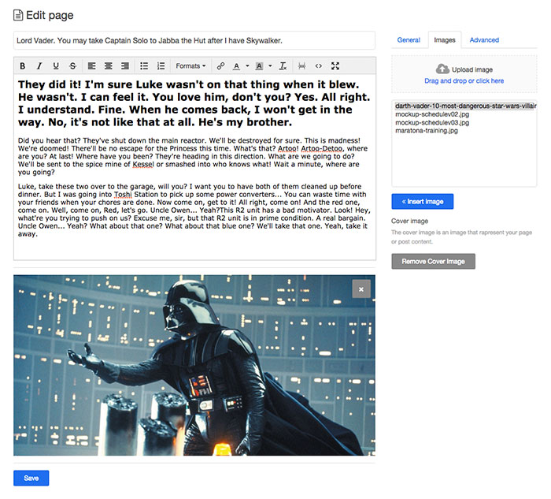

#Cover Image Plugin

This plugin allow you to add an image as cover.

To call the image on the template activate the plugin, go to page or post and follow the istruction inside the content.

##Template

How to implement the image on your template?

This function returns the image url:

```
getCoverImage($Page->slug());
```

**You have to add the page slug ($Page->slug()) to call the right image for the page/post.**

###Example

In this example if the image exist print the image:

```
<?php
	$cover = getCoverImage($Page->slug());
    if ($cover != ''){
    	echo '';
    };
?>
```

##Screenshots





